## fuzzyseg

**fuzzyseg** is an R package for segmenting images using Fuzzy C Means clustering with either a Euclidean or Mahalanobis distance. You may also specify a centroid initialization using the firefly algorithm, genetic algorithm, or the Biogeography-based optimization algorithm.

Segmented images are outputted in the specified save to directory. Additionally, either a hard or soft clustered image is returned. The program will shade pixels in the image either by a set amount (hard) or as a function of their membership (soft).

### Installing the package

Currently available using devtools:

```r
devtools::install_github("Danyulll/fuzzyseg")
```

### Getting started

Once installed you will have access to the FCM function. This is the main function of the package used to segments images. We recommend opening the help to examine what arguments are required.

```r
help(FCM)
```

Given any jpg image we can segment it using base FCM:

```r
FCM("./path","./saveto", numClust=3L, m=2,clusterMethod="Euclidean")
```

### Data 

The R package contains the following two images that can be used as examples and for testing purposes.

The first image is of a bunch of apples "apples.jpg":


The second image is a mammogram "birad4.jpg":


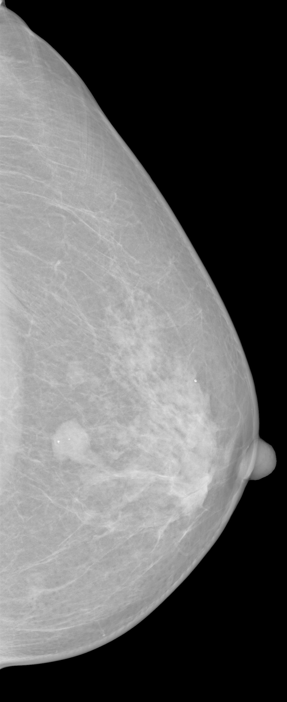


### Examples

#### FCM with Euclidean distance and no centroid initialization:
```r
FCM(".//data//src//apples.jpg","C://", numClust=3L, m=2,clusterMethod="Euclidean")
```
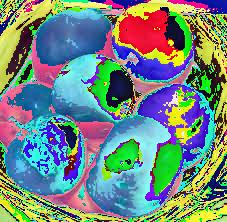

```r
FCM(".//data//src//birad4.jpg","C://", numClust=3L, m=2,clusterMethod="Euclidean")
```

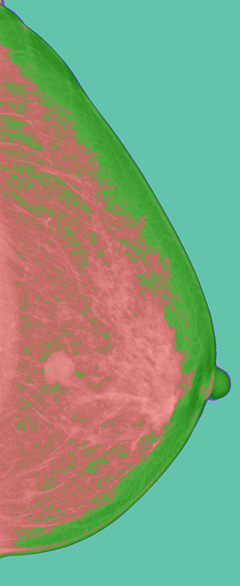

#### FCM with Euclidean distance and BBO centroid initialization:
```
FCM(".//data//src//apples.jpg","C://", numClust=3L, m=2,clusterMethod="Euclidean", centroid_init="BBO",  error=0.001, popSize=50L, maxGen=50L, bboAlpha=0.25, E=1, I=1, initError=0.001)
```

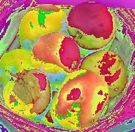

```r
FCM(".//data//src//birad4.jpg","C://", numClust=3L, m=2,clusterMethod="Euclidean", centroid_init="BBO",  error=0.001, popSize=50L, maxGen=50L, bboAlpha=0.25, E=1, I=1, initError=0.001)
```

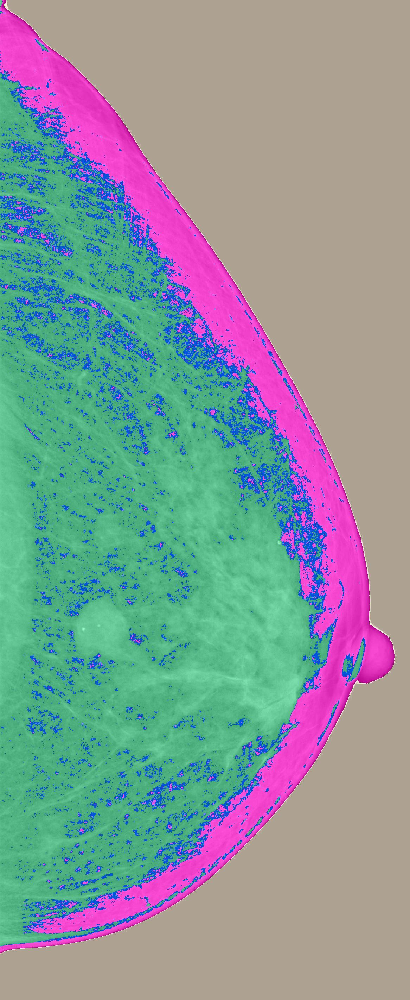

#### FCM with Euclidean distance and GA centroid initialization:

```r
FCM(".//data//src//apples.jpg","C://", numClust=3L, m=2,clusterMethod="Euclidean", centroid_init="GA",  error=0.001,  mutationRate=0.25, mutationStrength=1, initError=0.001)
```

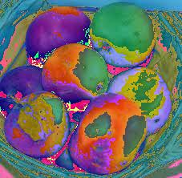

```r
FCM(".//data//src//birad4.jpg","C://", numClust=3L, m=2,clusterMethod="Euclidean", centroid_init="GA",  error=0.001,  mutationRate=0.25, mutationStrength=1, initError=0.001)
```

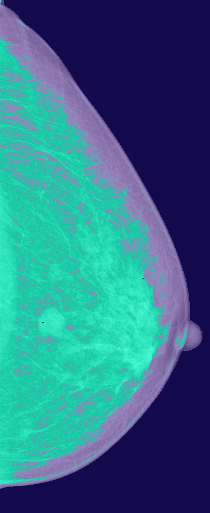

#### FCM with Euclidean distance and Firefly centroid initialization:

```r
FCM(".//data//src//apples.jpg","C://", numClust=3L, m=2, clusterMethod="Euclidean", centroid_init="firefly",  error=0.001, initError=0.001, fAlpha=0.05, fBeta=1, fGamma=1.5)
```

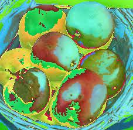

```r
FCM(".//data//src//birad4.jpg","C://", numClust=3L, m=2, clusterMethod="Euclidean", centroid_init="firefly",  error=0.001, initError=0.001, fAlpha=0.05, fBeta=1, fGamma=1.5)
```

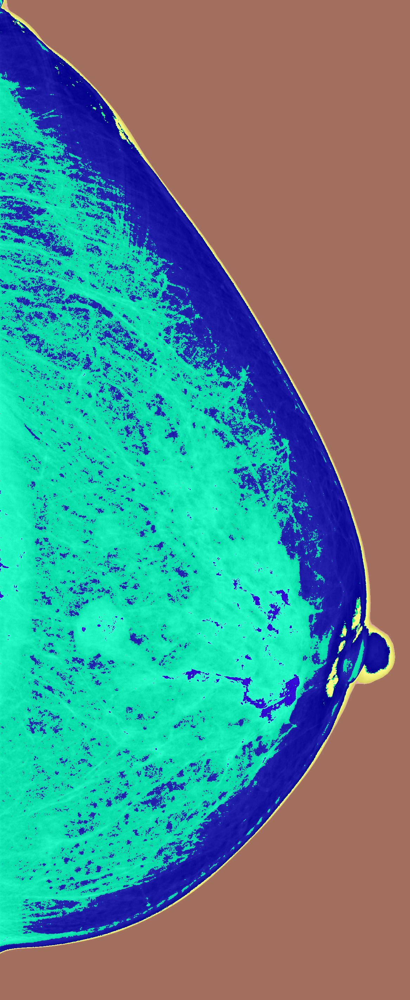


#### FCM with Mahalanobis distance and no centroid initialization:

```r
FCM(".//data//src//apples.jpg","C://", numClust=3L, m=2,clusterMethod="Mahalanobis")
```

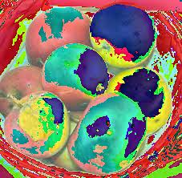

```r
FCM(".//data//src//birad4.jpg","C://", numClust=3L, m=2,clusterMethod="Mahalanobis")
```

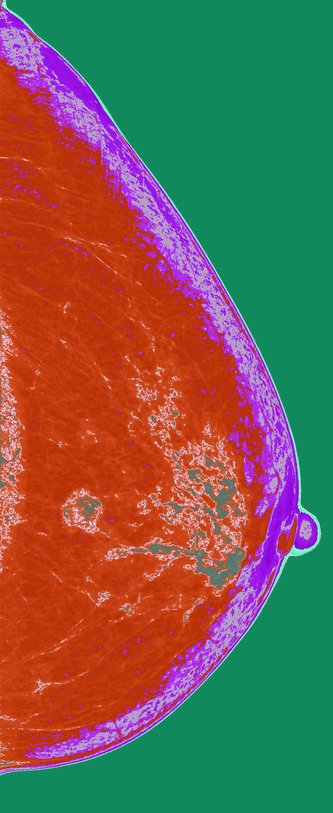

#### FCM with Mahalanobis distance and BBO centroid initialization:

```r
FCM(".//data//src//apples.jpg","C://", numClust=3L, m=2,clusterMethod="Mahalanobis", centroid_init="BBO",  error=0.001, popSize=50L, maxGen=50L, bboAlpha=0.25, E=1, I=1, initError=0.001)
```

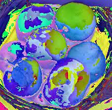

```r
FCM(".//data//src//birad4.jpg","C://", numClust=3L, m=2,clusterMethod="Mahalanobis", centroid_init="BBO",  error=0.001, popSize=50L, maxGen=50L, bboAlpha=0.25, E=1, I=1, initError=0.001)
```

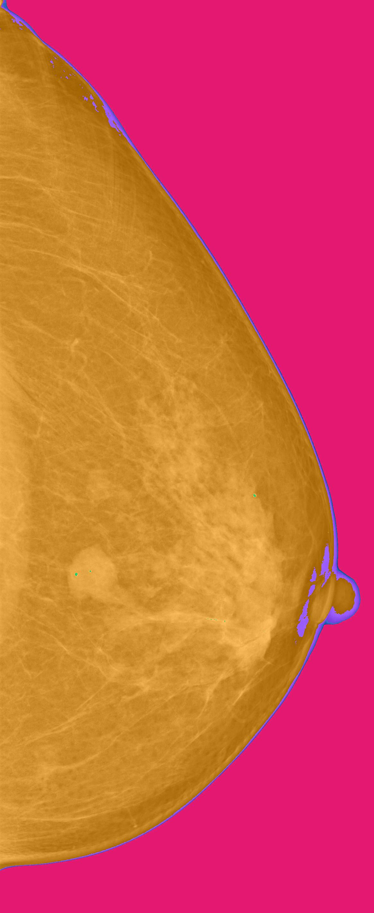

#### FCM with Mahalanobis distance and GA centroid initialization:

```r
FCM(".//data//src//apples.jpg","C://", numClust=3L, m=2,clusterMethod="Mahalanobis", centroid_init="GA",  error=0.001,  mutationRate=0.25, mutationStrength=1, initError=0.001)
```

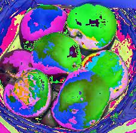

```r
FCM(".//data//src//birad4.jpg","C://", numClust=3L, m=2,clusterMethod="Mahalanobis", centroid_init="GA",  error=0.001,  mutationRate=0.25, mutationStrength=1, initError=0.001)
```


#### FCM with Mahalanobis distance and Firefly centroid initialization:

```r
FCM(".//data//src//apples.jpg","C://", numClust=3L, m=2, clusterMethod="Mahalanobis", centroid_init="firefly",  error=0.001, initError=0.001, fAlpha=0.05, fBeta=1, fGamma=1.5)
```

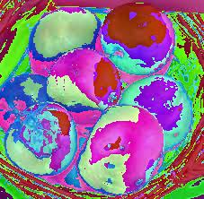

```r
FCM(".//data//src//birad4.jpg","C://", numClust=3L, m=2, clusterMethod="Mahalanobis", centroid_init="firefly",  error=0.001, initError=0.001, fAlpha=0.05, fBeta=1, fGamma=1.5)
```

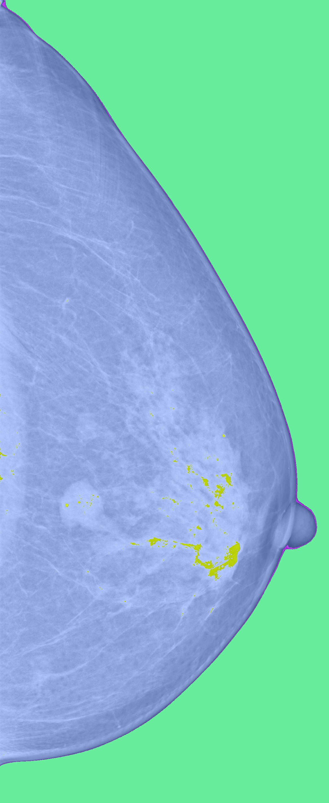
